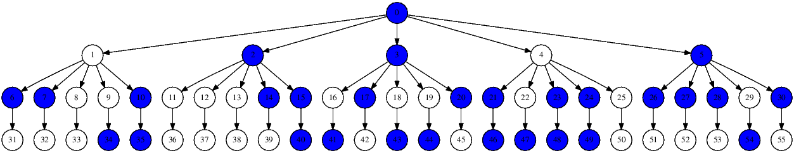

Graph Framework
===============

A framework to create and control graphs in C++, with the possibility of choosing one of the two most common graph implementations, which are based on *adjacencies lists* or *adjacencies matrix*. Also oriented/non-oriented mode is eligible.

## Usage
A real example of usage can be found on my [Dijkstra's Algorithm implementation](https://github.com/pablogomez93/Dijkstra). Also, there is a example.cpp file in this repository with a little example of usage, to watch it compile and run just use make all && make run.<br/>

To create a new Graph just use one of the following constructors:
```c++
//Creates an empty graph, non-oriented and based on adjacencies matrix
Graph g();
```
```c++
//Identical previous but initialized with nodes_count nodes
Graph g(unsigned int nodes_count);
```
```c++
//Identical previous but orientation prop specified
Graph g(unsigned int nodes_count, bool is_oriented);
```
```c++
//Identical previous but implementation specified, it can be ADJACENCIES_MATRIX or ADJACENCIES_LIST
Graph g(unsigned int nodes_count, bool is_oriented, Graph::IMPL implementation);
```
Then you are ready to use one of the available methods ([Full documentation here](#documentation)), for example:
```c++
#include "graph.h"
//...
unsigned int nodes = 10;
Graph g(nodes, true);
for (unsigned int current = 1; current < nodes; current++) {
    g.applyEdge(0, current);
    g.applyEdge(current, nodes-1);
    
    g.paintNode(rand()%nodes); //Paint random nodes
}
cout << g.getDOT(false);
```
Then, executing the previous code and dumping it, will give us a visual image of the graph:

    ./example | dot -Tpng -o graph.png

## Tests and Stress tests

There are also included a test suite which run some test to check the correcteness of the graph actions.<br/>
To run the included test you just must execute:

    make test

There is an stress_test too to put the graph under presion and check if it supports the charge.<br/>
If you wanna run it, you must be careful because it may put slow your computer for a while. To run it just do:

    make stress_test

## Documentation

Let ```V``` be the set of nodes of the graph and ```E``` the set of edges.
Also, let ```n``` be equals to ```|V|``` and ```m``` equals to ```|E|```.

In this implementation, the nodes are identified by non-negative integers strarting from 0 (inclusive) to n-1 (inclusive), the assigned integer for each node is assigned in order of arrival, in other words, the first node added to the graph will be assigned to the number 0, the next node to the number 1, and so on until the last node will be assigned to the number n-1.

About the edges, they are represented by a pair of nodes *(a, b)* where *a* and *b* are the ends of the edge and, if the graph is oriented, *a* is the origin and *b* is the destination. This led that there are as much ```n*(n-1)/2``` different edges in a non-oriented graph, and ```n*(n-1)``` in an oriented one.<br/>
Each edge may or may not have a specified numeric (float) weight on it, it is optional at the time to add the edge to the graph (it is an optional parameter). If none weight is provided at the time to create the edge, the default weight is 1.<br/>
The weight of the edges can be thought as the distance between a pair of nodes (the ends nodes of the edge). Hence, if you ask from the distance or weight of an edge that has not been already added to the graph, the answer will be the ```DEFAULT_WEIGHT``` constant which is the infinity float value.

### Available methods:
#### applyEdge
***Description:*** This methods applies a new edge to the graph between nodes *v1* and *v2*. Optionally, you can specify a numeric weight to put on the edge. If none weight is specified, the default weight is 1.<br/>
***Exception safety:*** If *v1* or *v2* aren't currents nodes on the graph or if *v1* is equals *v2*, an exception will be thrown.<br/>
***Returns:*** None

Implementation | Temporal complexity
------------ | -------------
ADJACENCIES_MATRIX | *O(1)*
ADJACENCIES_LIST | *O(1)*
```c++
void applyEdge(unsigned int v1, unsigned int v2[, float weight = 1]);
```
#### areAdjacent
***Description:*** This methods checks if two nodes *v1*, *v2* are adjacents. Note that in the case of an oriented graph, *v1* and *v2* will be adjacents if and only if exists an edge from *v1* to *v2*.<br/>
***Exception safety:*** If *v1* or *v2* aren't currents nodes on the graph or if *v1* is equals *v2*, an exception will be thrown.<br/>
***Returns:*** In a non-oriented graph, returns a boolean value indicating if an edge (*v1*,*v2*) or (*v2*,*v1*) exists. Otherwise, in an oriented graph, returns a boolean value indicating if an edge (*v1*,*v2*) exists.

Implementation | Temporal complexity
------------ | -------------
ADJACENCIES_MATRIX | *O(1)*
ADJACENCIES_LIST | *O(m)*
```c++
bool areAdjacent(unsigned int v1, unsigned int v2) const;
```
#### isOrientedGraph
***Description:*** A member function to ask for the oriented-node setting of the graph.<br/>
***Exception safety:*** this member function never throws exceptions.<br/>
***Returns:*** A boolean value indicating if the working mode of the graph is oriented or not, true if it is oriented, false otherwise.

Implementation | Temporal complexity
------------ | -------------
ADJACENCIES_MATRIX | *O(1)*
ADJACENCIES_LIST | *O(1)*
```c++
bool isOrientedGraph() const;
```
#### getNodesCount
***Description:*** A function to get the count of the nodes of the graph.<br/>
***Exception safety:*** this member function never throws exceptions.<br/>
***Returns:*** A non-negative integer indicating the number of nodes of the graph.

Implementation | Temporal complexity
------------ | -------------
ADJACENCIES_MATRIX | *O(1)*
ADJACENCIES_LIST | *O(1)*
```c++
unsigned int getNodesCount() const;
```
#### getEdgesCount
***Description:*** A function to get the count of different edges of the graph. Note that in an oriente-graph, *(x,y)* edge is different to the *(y,x)* edge, but, they are the same edge on a non-oriented graph<br/>
***Exception safety:*** this member function never throws exceptions.<br/>
***Returns:*** A non-negative integer indicating the number of different edges of the graph.

Implementation | Temporal complexity
------------ | -------------
ADJACENCIES_MATRIX | *O(1)*
ADJACENCIES_LIST | *O(1)*
```c++
unsigned int getEdgesCount() const;
```
#### getEdges
***Description:*** Return all edges of the graph, in a vector.<br/>
***Exception safety:*** this member function never throws exceptions.<br/>
***Returns:*** A reference to a linked list with every edge on the graph.

Implementation | Temporal complexity
------------ | -------------
ADJACENCIES_MATRIX | *O(1)* to return the linked-list reference.
ADJACENCIES_LIST | *O(1)* to return the linked-list reference.
```c++
list<Graph::Edge>& getEdges();
```
#### addVertex
***Description:*** Inserts a node (also called *vertex*) to the graph with out any adjacents.<br/>
***Exception safety:*** this member function never throws exceptions.<br/>
***Returns:*** A non-negative integer indicating the number assigned to the new added node. That number will always be the new count of nodes - 1.

Implementation | Temporal complexity
------------ | -------------
ADJACENCIES_MATRIX | *O(n)* amortized. *O(n²)* worst case.
ADJACENCIES_LIST | *O(1)* amortized. *O(n)* worst case.
```c++
unsigned int addVertex();
```
#### getEdgeWeight
***Description:*** A funtion to ask the weight of the edge between nodes *v1* and *v2*. If the graph is non-oriented, the orden of the parameters doesn't matter, but it's important in a oriented graph; in that case *v1* indicates the origin of the edge, and *v2* indicates the end.<br/>
***Exception safety:*** If *v1* or *v2* aren't currents nodes on the graph or if *v1* is equals *v2*, an exception will be thrown.<br/>
***Returns:***  A floating-point value with the edge weight between *v1* and *v2*. As it mentioned in the documentation intro, if there is not an edge between *v1* y *v2*, the ```DEFAULT_WEIGHT``` constant will be returned, which is the infinity float value.

Implementation | Temporal complexity
------------ | -------------
ADJACENCIES_MATRIX | *O(1)*
ADJACENCIES_LIST | *O(m)*
```c++
float getEdgeWeight(unsigned int v1, unsigned int v2) const;
```
#### isIsolatedNode
***Description:*** Test if a node *v* is isolated or not. An isolated node is a node that is not an startpoint or endpoint of any edge.<br/>
***Exception safety:*** If *v* is not a node of the graph, an exception will be thrown.<br/>
***Returns:*** A boolean value indicating if *v* is an isolated node. True if it is, false otherwise.

Implementation | Temporal complexity
------------ | -------------
ADJACENCIES_MATRIX | *O(1)*
ADJACENCIES_LIST | *O(1)*
```c++
bool isIsolatedNode(unsigned int v) const;
```
#### fill
***Description:*** This method completes the graph, that means, it apply all missed edges of the graph until the graph is complete. After this procedure finish, the graph will be a complete graph with *n . (n-1)* different edges for an oriented-graph and with *n . (n-1) / 2* different edges for a non-oriented graph.<br/>
***Exception safety:*** this member function never throws exceptions.<br/>
***Returns:*** None.

Implementation | Temporal complexity
------------ | -------------
ADJACENCIES_MATRIX | *O(n²)*
ADJACENCIES_LIST | *O(n²)*
```c++
void fill();
```
#### paintNode
***Description:*** Paint the *v* node to remark it. If the graphic representation of the graph is requested (see ***.getDOT*** method) the node will appear colorful.<br/>
***Exception safety:*** If *v* is not a node of the graph, an exception will be thrown.<br/>
***Returns:*** None

Implementation | Temporal complexity
------------ | -------------
ADJACENCIES_MATRIX | *O(1)*
ADJACENCIES_LIST | *O(1)*
```c++
void paintNode(unsigned int v);
```
#### paintedNode
***Description:*** Test if a node is painted o not (to see what means that a node is painted see ***.paintNode*** method).<br/>
***Exception safety:*** If *v* is not a node of the graph, an exception will be thrown.<br/>
***Returns:*** A boolean value indicating if the node is painted or not.

Implementation | Temporal complexity
------------ | -------------
ADJACENCIES_MATRIX | *O(1)*
ADJACENCIES_LIST | *O(1)*
```c++
bool paintedNode(unsigned int v);
```
#### unpaintNode
***Description:*** Unpaint the node *v* (to see what means that a node is painted see ***.paintNode*** method). If the graphic representation of the graph is requested (see ***.getDOT*** method) the node will appear colorless.<br/>
***Exception safety:*** If *v* is not a node of the graph, an exception will be thrown.<br/>
***Returns:*** None

Implementation | Temporal complexity
------------ | -------------
ADJACENCIES_MATRIX | *O(1)*
ADJACENCIES_LIST | *O(1)*
```c++
void unpaintNode(unsigned int v);
```
#### paintEdge
***Description:*** Paint the edge pointed by *e* to remark it. If the graphic representation of the graph is requested (see ***.getDOT*** method) the edge will appear colorful.<br/>
***Exception safety:*** If NULL is passed by parameter an exception will be thrown.<br/>
***Returns:*** None

Implementation | Temporal complexity
------------ | -------------
ADJACENCIES_MATRIX | *O(1)*
ADJACENCIES_LIST | *O(1)*
```c++
void paintEdge(Edge* e);
```
#### paintedEdge
***Description:*** Test if the edge poited by *e* is painted o not (to see what means that an edge is painted see ***.paintEdge*** method).<br/>
***Exception safety:*** If NULL is passed by parameter an exception will be thrown.<br/>
***Returns:*** A boolean value indicating if the edge pointed by *e* is painted or not.

Implementation | Temporal complexity
------------ | -------------
ADJACENCIES_MATRIX | *O(1)*
ADJACENCIES_LIST | *O(1)*
```c++
bool paintedEdge(Edge* e);
```
#### unpaintEdge
***Description:*** Unpaint the edge pointed by *e* (to see what means that an edge is painted see ***.paintEdge*** method). If the graphic representation of the graph is requested (see ***.getDOT*** method) the edge will appear colorless.<br/>
***Exception safety:*** If NULL is passed by parameter an exception will be thrown.<br/>
***Returns:*** None

Implementation | Temporal complexity
------------ | -------------
ADJACENCIES_MATRIX | *O(1)*
ADJACENCIES_LIST | *O(1)*
```c++
void unpaintEdge(Edge* e);
```
#### getDOT
***Description:*** Returns a string containing the representation of the graph in the .DOT standard format for representing graphs. It is useful as input of a generic graphic tool for drawing graphs, as *graphviz*. This method has an optional parameter *weighted* (default is true) to indicate if the weights of the edges must be printed or not. If the graph is in oriented-mode, the edges will appear as arrows, and as lines otherwise.<br/>
***Exception safety:*** this member function never throws exceptions.<br/>
***Returns:*** A string containing the dot representation of the graph, including painted nodes and edges.

Implementation | Temporal complexity
------------ | -------------
ADJACENCIES_MATRIX | *O(m + n)*
ADJACENCIES_LIST | *O(m + n)*
```c++
string getDOT(bool weighted = true) const;
```
#### exportDOT
***Description:*** Idem to the **.getDOT** method but exporting the result to a file named *file_name*. If the file already exists, it throws a warning and stop the process. To force the override of the file, use the second argument *force_override* who is false by default.<br/>
***Exception safety:*** this member function never throws exceptions but throws warnings if the *force_override* param is setted to false and the file named *file_name* already exists.<br/>
***Returns:*** None.

Implementation | Temporal complexity
------------ | -------------
ADJACENCIES_MATRIX | *O(m + n)*
ADJACENCIES_LIST | *O(m + n)*
```c++
void exportDOT(const char* file_name, bool force_override = false) const;
```
```c++
/*
 * Return an iterator of the adjacents nodes for a single node in the graph.
 */
const AdjacentsIterator adjacentsOf(unsigned int v) const;
```
